<div align="center">

# 📊 Market Impact Analysis System

### Kubernetes Deployment with Helm Charts

[](https://kubernetes.io/)
[](https://helm.sh/)
[](https://fluxcd.io/)
[](https://www.docker.com/)

[](https://opensource.org/licenses/MIT)
[](./helm/market-impact-analysis-system/Chart.yaml)
[](https://kubernetes.io/)

**A cloud-native financial news analysis platform powered by microservices architecture**

[Features](#-features) • [Architecture](#-architecture) • [Quick Start](#-quick-start) • [Configuration](#-configuration) • [Deployment](#-deployment)

</div>

---

## 📋 Table of Contents

- [Overview](#-overview)
- [Features](#-features)
- [Architecture](#-architecture)
- [Prerequisites](#-prerequisites)
- [Quick Start](#-quick-start)
- [Repository Structure](#-repository-structure)
- [Configuration](#-configuration)
- [Deployment](#-deployment)
- [GitOps Workflow](#-gitops-workflow)
- [Migration Guide](#-migration-guide)
- [Monitoring & Troubleshooting](#-monitoring--troubleshooting)
- [Best Practices](#-best-practices)

---

## 🎯 Overview

The **Market Impact Analysis System** is a sophisticated microservices-based platform designed to ingest, process, and analyze financial news data in real-time. Built with cloud-native principles, it provides scalable, resilient infrastructure for market impact assessment.

### 🌟 Why Helm?

We've migrated from Kustomize to Helm to leverage:

- ✅ **Superior Templating** - Conditional logic, loops, and reusable functions
- ✅ **Release Management** - Built-in versioning, rollback, and upgrade capabilities
- ✅ **Values Hierarchy** - Clean environment-specific configuration
- ✅ **Dependency Management** - Native chart dependencies support
- ✅ **Testing & Validation** - Built-in linting and template testing
- ✅ **Community Ecosystem** - Access to thousands of community charts

---

## ✨ Features

<table>
<tr>
<td width="50%">

### 🚀 Platform Capabilities

- 📰 **Real-time News Ingestion**
- 🧠 **NLP Processing & Sentiment Analysis**
- 📈 **Market Impact Prediction**
- 🔔 **Intelligent Alert System**
- 🔄 **Auto-scaling & Self-healing**
- 🌐 **Multi-environment Support**

</td>
<td width="50%">

### 🛠️ Technical Stack

- ⚙️ **Kubernetes** - Orchestration
- 🎭 **Helm** - Package Management
- 🔄 **Flux CD** - GitOps Delivery
- 🗄️ **PostgreSQL** - Data Storage
- ⚡ **Redis** - Caching Layer
- 🔌 **gRPC** - Service Communication

</td>
</tr>
</table>

---

## 🏗️ Architecture

### System Architecture

```mermaid
graph TB
    subgraph "External Services"
        NewsAPI[📰 News APIs]
    end
    
    subgraph "Kubernetes Cluster"
        subgraph "Ingestion Layer"
            NI[🔵 News Ingestion<br/>Port: 4001/4002]
        end
        
        subgraph "Processing Layer"
            NLP[🟣 NLP Processing<br/>Port: 50052]
        end
        
        subgraph "Analysis Layer"
            MI[🟢 Market Impact<br/>Port: 8082/9090]
        end
        
        subgraph "Alert Layer"
            AS[🟠 Alert Signal<br/>Port: 8081/9095]
        end
        
        subgraph "Data Layer"
            DB[(🗄️ PostgreSQL)]
            Redis[(⚡ Redis Cache)]
        end
    end
    
    NewsAPI -->|Fetch News| NI
    NI -->|gRPC| NLP
    NLP -->|Analysis| MI
    MI -->|Signals| AS
    
    NI -.->|Store| DB
    NLP -.->|Store| DB
    MI -.->|Store| DB
    AS -.->|Store| DB
    
    NI -.->|Cache| Redis
    NLP -.->|Cache| Redis
    MI -.->|Cache| Redis
    AS -.->|Cache| Redis
    
    style NI fill:#4A90E2
    style NLP fill:#9B59B6
    style MI fill:#2ECC71
    style AS fill:#E67E22
    style DB fill:#34495E
    style Redis fill:#E74C3C
```

### Service Communication Flow

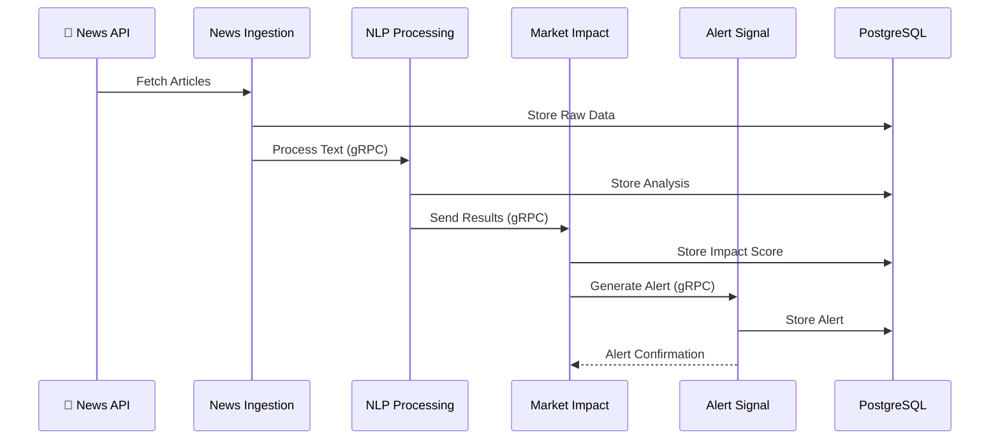

---

## 📦 Repository Structure

```mermaid
graph LR
    Root[📁 Repository Root]
    
    Root --> Helm[📂 helm/]
    Root --> Clusters[📂 clusters/]
    Root --> Scripts[📄 Scripts]
    
    Helm --> Chart[📊 market-impact-analysis-system/]
    Chart --> ChartYaml[Chart.yaml]
    Chart --> Values[values.yaml]
    Chart --> ValuesProd[values-production.yaml]
    Chart --> ValuesStage[values-staging.yaml]
    Chart --> Templates[📂 templates/]
    
    Templates --> AlertSig[📁 alert-signal/]
    Templates --> MarketImp[📁 market-impact/]
    Templates --> NewsIng[📁 news-ingestion/]
    Templates --> NLP[📁 nlp-processing/]
    
    Clusters --> Prod[📂 production/]
    Clusters --> Stage[📂 staging/]
    
    Prod --> ProdHelm[helmrelease.yaml]
    Prod --> ProdFlux[flux-system/]
    
    Stage --> StageHelm[helmrelease.yaml]
    Stage --> StageFlux[flux-system/]
    
    Scripts --> Migrate[migrate-to-helm.sh]
    Scripts --> Readme[README.md]
    
    style Root fill:#2C3E50
    style Helm fill:#3498DB
    style Clusters fill:#E74C3C
    style Chart fill:#9B59B6
    style Templates fill:#16A085
```

### Directory Structure

```
📦 market-impact-analysis-system
├── 📂 helm/
│   └── 📂 market-impact-analysis-system/
│       ├── 📄 Chart.yaml                    # Chart metadata
│       ├── 📄 values.yaml                   # Default values
│       ├── 📄 values-production.yaml        # Production config
│       ├── 📄 values-staging.yaml           # Staging config
│       ├── 📄 .helmignore                   # Ignore patterns
│       └── 📂 templates/
│           ├── 📄 _helpers.tpl              # Template helpers
│           ├── 📄 NOTES.txt                 # Post-install notes
│           ├── 📄 namespace.yaml
│           ├── 📂 alert-signal/
│           │   ├── deployment.yaml
│           │   ├── service.yaml
│           │   └── hpa.yaml
│           ├── 📂 market-impact/
│           │   ├── deployment.yaml
│           │   ├── service.yaml
│           │   └── hpa.yaml
│           ├── 📂 news-ingestion/
│           │   ├── deployment.yaml
│           │   ├── service.yaml
│           │   └── hpa.yaml
│           └── 📂 nlp-processing/
│               ├── deployment.yaml
│               ├── service.yaml
│               └── hpa.yaml
├── 📂 clusters/
│   ├── 📂 production/
│   │   ├── 📄 helmrelease.yaml
│   │   └── 📂 flux-system/
│   └── 📂 staging/
│       ├── 📄 helmrelease.yaml
│       └── 📂 flux-system/
├── 📄 migrate-to-helm.sh                    # Migration script
└── 📄 README.md                             # This file
```

---

## 🔧 Prerequisites

### Required Tools

| Tool | Minimum Version | Purpose |
|------|----------------|---------|
|  | v1.24+ | Container Orchestration |
|  | v3.10+ | Package Management |
|  | v1.24+ | Cluster Management |
|  | v2.0+ | GitOps (Optional) |

### Installation

```bash
# Install Helm
curl https://raw.githubusercontent.com/helm/helm/main/scripts/get-helm-3 | bash

# Install kubectl
curl -LO "https://dl.k8s.io/release/$(curl -L -s https://dl.k8s.io/release/stable.txt)/bin/linux/amd64/kubectl"
chmod +x kubectl && sudo mv kubectl /usr/local/bin/

# Install Flux CLI (optional)
curl -s https://fluxcd.io/install.sh | sudo bash
```

---

## 🚀 Quick Start

### 1️⃣ Clone the Repository

```bash
git clone https://github.com/your-org/market-impact-analysis-system.git
cd market-impact-analysis-system
```

### 2️⃣ Create Required Secrets

```bash
# Database credentials
kubectl create secret generic db-credentials \
  --from-literal=host=postgres.example.com \
  --from-literal=port=5432 \
  --from-literal=username=dbuser \
  --from-literal=password=dbpass \
  --from-literal=database=marketdb \
  --namespace financial-news

# Redis credentials
kubectl create secret generic redis-credentials \
  --from-literal=host=redis.example.com \
  --from-literal=port=6379 \
  --from-literal=password=redispass \
  --namespace financial-news

# API keys
kubectl create secret generic api-keys \
  --from-literal=newsapi-key=your-newsapi-key \
  --namespace financial-news
```

### 3️⃣ Install the Chart

```bash
# Development
helm install market-impact ./helm/market-impact-analysis-system \
  --namespace financial-news \
  --create-namespace

# Production
helm install market-impact ./helm/market-impact-analysis-system \
  --namespace financial-news \
  --create-namespace \
  --values ./helm/market-impact-analysis-system/values-production.yaml
```

### 4️⃣ Verify Deployment

```bash
# Check all resources
kubectl get all -n financial-news

# Check HPA status
kubectl get hpa -n financial-news

# View pod logs
kubectl logs -f deployment/news-ingestion -n financial-news
```

---

## ⚙️ Configuration

### Helm Values Hierarchy

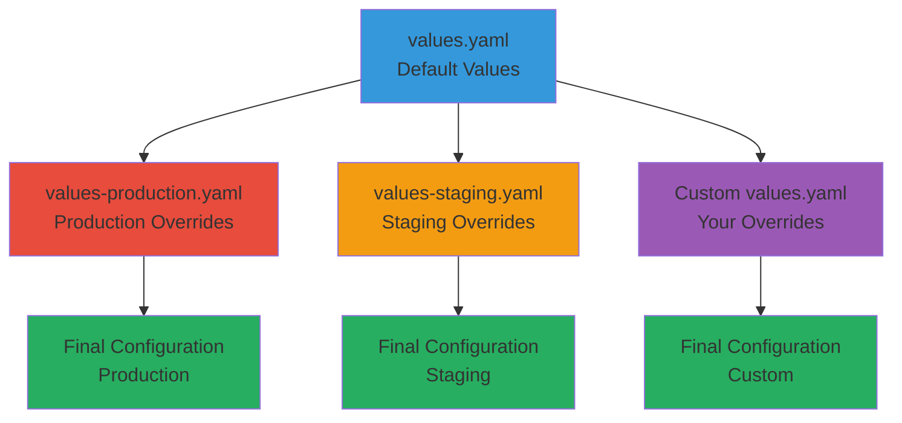

### Key Configuration Sections

<details>
<summary><b>🌍 Global Settings</b></summary>

```yaml
global:
  namespace: financial-news
  environment: production
  imageRegistry: your-registry
  imagePullPolicy: IfNotPresent
```
</details>

<details>
<summary><b>🔔 Alert Signal Service</b></summary>

```yaml
alertSignal:
  enabled: true
  replicaCount: 3
  resources:
    requests:
      memory: "512Mi"
      cpu: "200m"
    limits:
      memory: "1Gi"
      cpu: "1000m"
  autoscaling:
    minReplicas: 3
    maxReplicas: 8
```
</details>

<details>
<summary><b>📈 Market Impact Service</b></summary>

```yaml
marketImpact:
  enabled: true
  replicaCount: 3
  resources:
    requests:
      memory: "1Gi"
      cpu: "500m"
    limits:
      memory: "2Gi"
      cpu: "1500m"
```
</details>

<details>
<summary><b>📰 News Ingestion Service</b></summary>

```yaml
newsIngestion:
  enabled: true
  replicaCount: 3
  resources:
    requests:
      memory: "1Gi"
      cpu: "500m"
```
</details>

<details>
<summary><b>🧠 NLP Processing Service</b></summary>

```yaml
nlpProcessing:
  enabled: true
  replicaCount: 5
  resources:
    requests:
      memory: "2Gi"
      cpu: "1000m"
    limits:
      memory: "4Gi"
      cpu: "3000m"
```
</details>

### Environment Comparison

| Component | Development | Staging | Production |
|-----------|------------|---------|------------|
| **Replicas** | 1 | 1-2 | 3-15 |
| **CPU Request** | 50m-250m | 100m-500m | 200m-1000m |
| **Memory Request** | 128Mi-512Mi | 256Mi-1Gi | 512Mi-4Gi |
| **Autoscaling** | Disabled | Limited | Full |
| **Image Tag** | latest | staging | v1.0.0 |

---

## 🚢 Deployment

### Deployment Flow

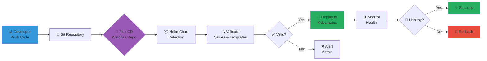

### Manual Deployment

#### Option 1: Direct Helm Install

```bash
# Install
helm install market-impact ./helm/market-impact-analysis-system \
  --namespace financial-news \
  --create-namespace \
  --values ./helm/market-impact-analysis-system/values-production.yaml

# Upgrade
helm upgrade market-impact ./helm/market-impact-analysis-system \
  --namespace financial-news \
  --values ./helm/market-impact-analysis-system/values-production.yaml

# Rollback
helm rollback market-impact 1 --namespace financial-news

# Uninstall
helm uninstall market-impact --namespace financial-news
```

#### Option 2: Template and Apply

```bash
# Generate manifests
helm template market-impact ./helm/market-impact-analysis-system \
  --values ./helm/market-impact-analysis-system/values-production.yaml \
  --output-dir ./rendered

# Apply manually
kubectl apply -f ./rendered/market-impact-analysis-system/templates/
```

### GitOps Deployment with Flux

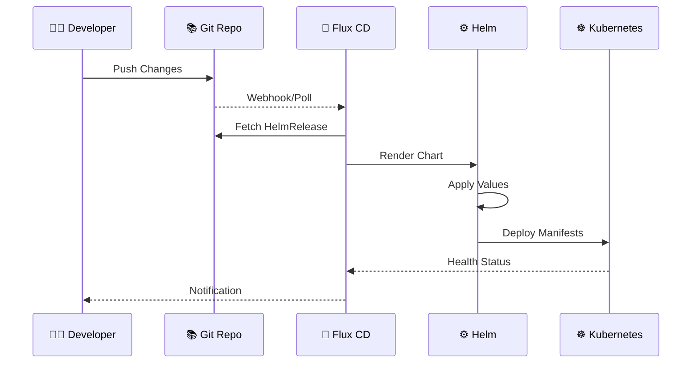

#### Setup Flux

```bash
# Bootstrap Flux
flux bootstrap github \
  --owner=your-org \
  --repository=market-impact-analysis-system \
  --branch=main \
  --path=clusters/production \
  --personal

# Check Flux status
flux get all

# Force reconciliation
flux reconcile helmrelease market-impact-analysis-system -n flux-system
```

---

## 🔄 GitOps Workflow

### Continuous Deployment Pipeline

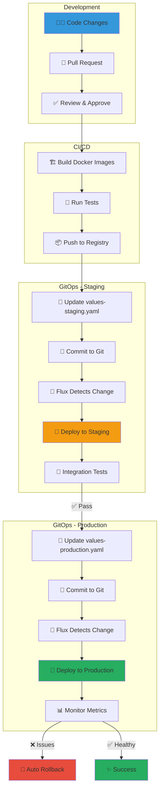

### Promotion Flow

```bash
# 1. Deploy to Staging
git checkout staging
# Update values-staging.yaml with new image tags
git add helm/market-impact-analysis-system/values-staging.yaml
git commit -m "Deploy v1.2.0 to staging"
git push origin staging
# Flux automatically deploys to staging

# 2. Test in Staging
kubectl get pods -n financial-news-staging
# Run integration tests

# 3. Promote to Production
git checkout main
# Update values-production.yaml
git add helm/market-impact-analysis-system/values-production.yaml
git commit -m "Deploy v1.2.0 to production"
git push origin main
# Flux automatically deploys to production
```

---

## 🔀 Migration Guide

### From Kustomize to Helm

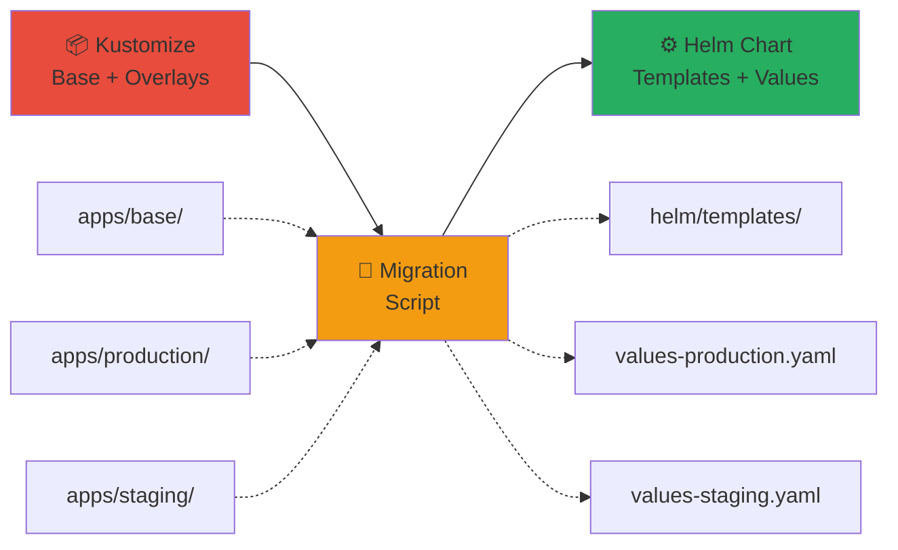

### Step-by-Step Migration

#### 1. Run Migration Script

```bash
# Make script executable
chmod +x migrate-to-helm.sh

# Run migration
./migrate-to-helm.sh
```

The script will:
- ✅ Validate prerequisites
- ✅ Backup existing Kustomize files
- ✅ Create Helm chart structure
- ✅ Validate Helm templates
- ✅ Render manifests for review
- ✅ Optionally deploy to staging

#### 2. Review Generated Manifests

```bash
# Check rendered templates
tree rendered-manifests/

# Compare with existing deployments
kubectl get deployment news-ingestion -n financial-news -o yaml
helm template market-impact ./helm/market-impact-analysis-system \
  --values values-production.yaml | grep -A 20 "kind: Deployment"
```

#### 3. Update Flux Configuration

```bash
# Remove old Kustomization
kubectl delete kustomization apps -n flux-system

# Apply new HelmRelease
kubectl apply -f clusters/production/helmrelease.yaml
```

#### 4. Verify Migration

```bash
# Check Flux status
flux get helmreleases

# Monitor deployment
watch kubectl get pods -n financial-news

# Verify services
kubectl get svc -n financial-news
```

---

## 📊 Monitoring & Troubleshooting

### Health Checks

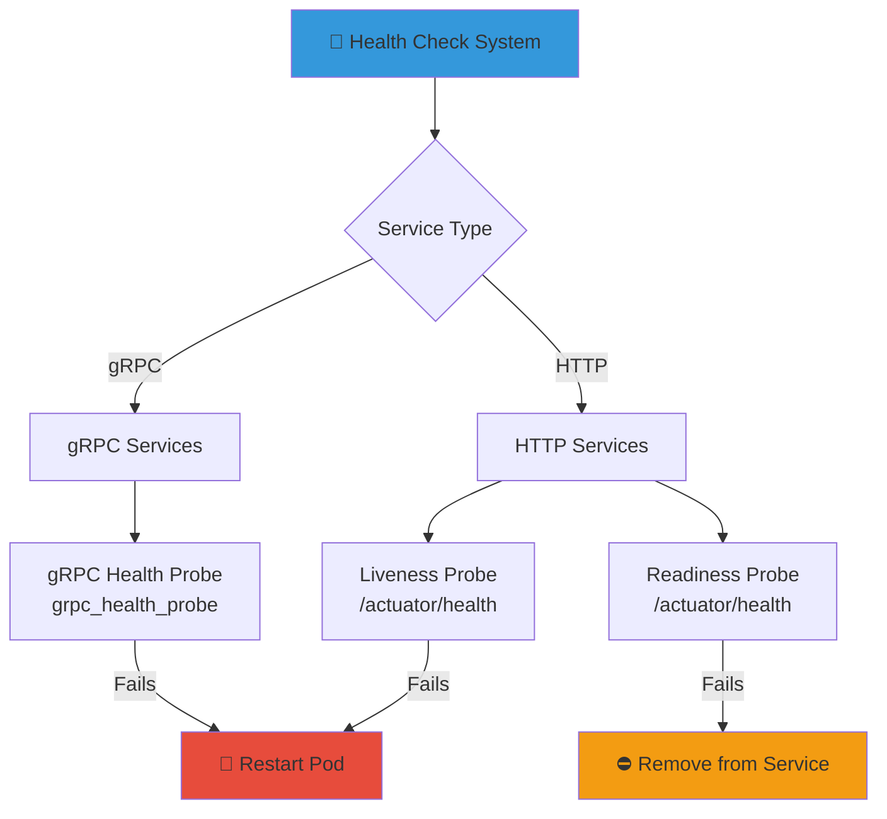

### Common Commands

```bash
# 📊 View all resources
kubectl get all -n financial-news

# 🔍 Check pod status
kubectl get pods -n financial-news -o wide

# 📝 View logs
kubectl logs -f deployment/news-ingestion -n financial-news
kubectl logs -f deployment/nlp-processing -n financial-news --tail=100

# 🔧 Debug pod
kubectl describe pod <pod-name> -n financial-news
kubectl exec -it <pod-name> -n financial-news -- /bin/bash

# 📈 Check HPA status
kubectl get hpa -n financial-news
kubectl describe hpa nlp-processing -n financial-news

# 🔄 Check Helm releases
helm list -n financial-news
helm status market-impact -n financial-news
helm history market-impact -n financial-news

# 🎯 Flux troubleshooting
flux get sources git
flux get helmreleases
flux logs --level=error
kubectl describe helmrelease market-impact-analysis-system -n flux-system
```

### Troubleshooting Decision Tree

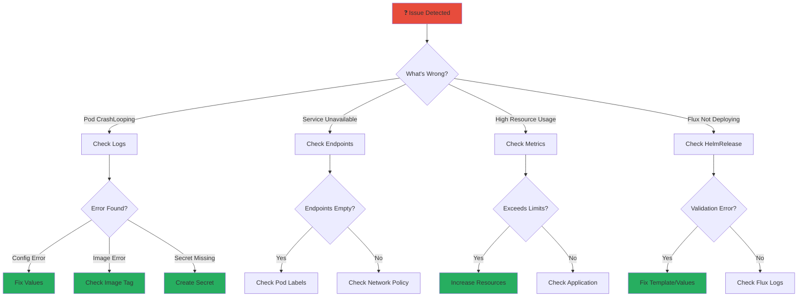

---

## 💡 Best Practices

### 🎯 Configuration Management

```yaml
# ✅ DO: Use values files for environment-specific config
helm install app ./chart -f values-production.yaml

# ❌ DON'T: Use --set for complex configurations
helm install app ./chart --set image.tag=v1.0.0 --set replicas=3...
```

### 🔒 Security

- 🔐 **Never commit secrets** to Git
- 🎭 Use **Sealed Secrets** or **External Secrets Operator**
- 🛡️ Enable **Pod Security Policies**
- 🔍 Regularly **scan images** for vulnerabilities

### 📊 Resource Management

```yaml
# Always set resource requests and limits
resources:
  requests:    # Guaranteed resources
    memory: "512Mi"
    cpu: "250m"
  limits:      # Maximum allowed
    memory: "1Gi"
    cpu: "1000m"
```

### 🔄 Deployment Strategy

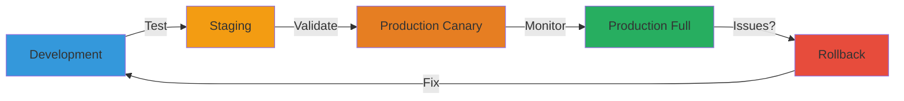

### 📝 Version Control

```bash
# Semantic versioning for chart
Chart.yaml:
  version: 1.2.3  # MAJOR.MINOR.PATCH

# Tag Docker images
image:
  tag: v1.2.3    # Not 'latest' in production
```

---

## 📚 Additional Resources

### 📖 Documentation

- [Helm Official Docs](https://helm.sh/docs/)
- [Kubernetes Documentation](https://kubernetes.io/docs/)
- [Flux CD Documentation](https://fluxcd.io/docs/)
- [Kustomize to Helm Migration](https://helm.sh/docs/topics/charts/#kustomize)

### 🎓 Learning Resources

- [Helm Workshop](https://helm.sh/docs/intro/quickstart/)
- [GitOps Principles](https://www.gitops.tech/)
- [Kubernetes Patterns](https://kubernetes.io/docs/concepts/cluster-administration/manage-deployment/)

### 🛠️ Tools

| Tool | Purpose | Link |
|------|---------|------|
| **k9s** | Terminal UI for Kubernetes | [k9scli.io](https://k9scli.io/) |
| **Lens** | Kubernetes IDE | [k8slens.dev](https://k8slens.dev/) |
| **Helm Dashboard** | Web UI for Helm | [github.com/komodorio/helm-dashboard](https://github.com/komodorio/helm-dashboard) |

---

## 🤝 Contributing

We welcome contributions! Please see our [Contributing Guidelines](CONTRIBUTING.md).

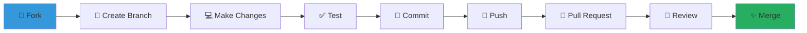

---

## 📄 License

This project is licensed under the MIT License - see the [LICENSE](LICENSE) file for details.

---


[🏠 Home](#-market-impact-analysis-system) • [⬆ Back to Top](#-market-impact-analysis-system)

</div>
