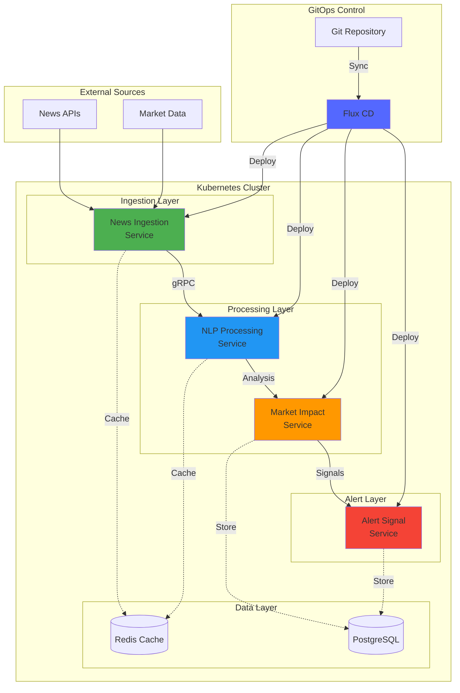
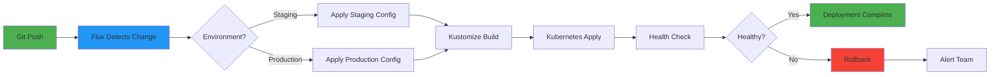
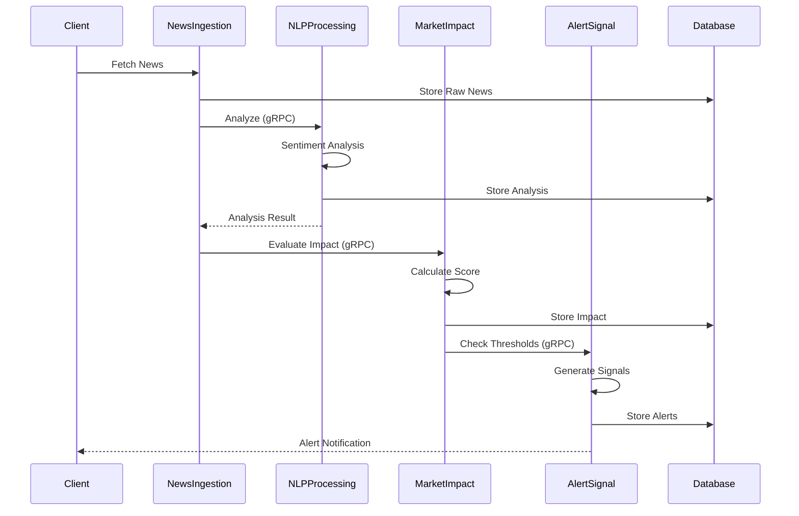
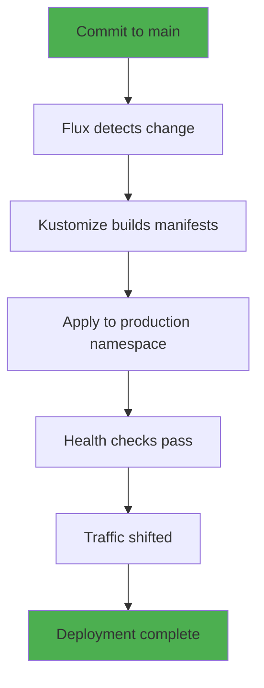
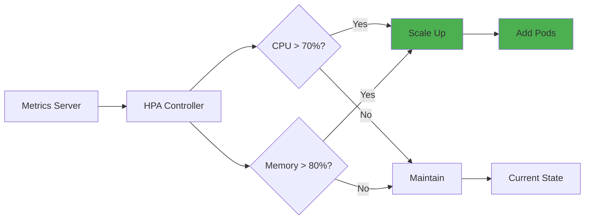

# 📈 Market Impact Analysis System - Flux GitOps

<div align="center">


*A cloud-native financial news analysis platform with real-time market impact assessment*

[Features](#-features) • [Architecture](#-architecture) • [Getting Started](#-getting-started) • [Deployment](#-deployment) • [Documentation](#-documentation)

</div>

---

## 📋 Table of Contents

- [Overview](#-overview)
- [Features](#-features)
- [Architecture](#-architecture)
- [Repository Structure](#-repository-structure)
- [Microservices](#-microservices)
- [Getting Started](#-getting-started)
- [Deployment](#-deployment)
- [Configuration](#-configuration)
- [Monitoring](#-monitoring)
- [Contributing](#-contributing)

---

## 🎯 Overview

The **Market Impact Analysis System** is a sophisticated microservices-based platform that ingests financial news, performs NLP analysis, evaluates market impact, and generates real-time alerts. Built with cloud-native technologies and managed via GitOps principles using Flux CD.

### Key Highlights

- 🚀 **Cloud-Native**: Kubernetes-based with auto-scaling capabilities
- 🔄 **GitOps**: Flux CD for declarative continuous delivery
- 📊 **Real-Time Processing**: Instant news analysis and market impact assessment
- 🤖 **NLP Powered**: Advanced natural language processing for sentiment analysis
- 🔔 **Intelligent Alerts**: Automated signal generation based on market conditions
- 🏗️ **Multi-Environment**: Separate staging and production configurations

---

## ✨ Features

### Core Capabilities

| Feature | Description |
|---------|-------------|
| **News Ingestion** | Automated fetching from multiple financial news sources |
| **NLP Processing** | Sentiment analysis, entity extraction, topic modeling |
| **Market Impact** | Real-time impact scoring and trend analysis |
| **Alert Signals** | Intelligent notification system for significant events |
| **Auto-Scaling** | HPA-based horizontal pod autoscaling |
| **High Availability** | Multi-replica deployments with health checks |

### Technical Features

- ✅ gRPC inter-service communication
- ✅ Redis caching layer
- ✅ PostgreSQL persistent storage
- ✅ Kubernetes-native deployment
- ✅ GitOps workflow with Flux CD
- ✅ Multi-environment support (staging/production)

---

## 🏛️ Architecture

### System Architecture



### Deployment Flow



### Service Communication



---

## 📁 Repository Structure

```
Flux-gitops-Market-Impact-Analysis-system/
├── apps/
│   ├── news-ingestion/          # News ingestion microservice
│   │   ├── deployment.yaml
│   │   ├── service.yaml
│   │   ├── hpa.yaml
│   │   └── kustomization.yaml
│   ├── nlp-processing/          # NLP processing microservice
│   │   ├── deployment.yaml
│   │   ├── service.yaml
│   │   ├── hpa.yaml
│   │   └── kustomization.yaml
│   ├── market-impact/           # Market impact analysis microservice
│   │   ├── deployment.yaml
│   │   ├── service.yaml
│   │   ├── hpa.yaml
│   │   └── kustomization.yaml
│   ├── alert-signal/            # Alert signal microservice
│   │   ├── deployment.yaml
│   │   ├── service.yaml
│   │   ├── hpa.yaml
│   │   └── kustomization.yaml
│   ├── production/              # Production overlays
│   │   ├── kustomization.yaml
│   │   └── namespace.yaml
│   └── staging/                 # Staging overlays
│       ├── kustomization.yaml
│       └── namespace.yaml
├── clusters/
│   ├── production/              # Production cluster config
│   │   ├── flux-system/
│   │   │   ├── gotk-components.yaml
│   │   │   ├── gotk-sync.yaml
│   │   │   └── kustomization.yaml
│   │   └── apps.yaml
│   └── staging/                 # Staging cluster config
│       ├── flux-system/
│       └── apps.yaml
└── README.md
```

---

## 🔧 Microservices

### 1. News Ingestion Service

**Purpose**: Fetch and normalize financial news from multiple sources

- **Port**: HTTP 4001, gRPC 4002
- **Replicas**: 2-5 (auto-scaling)
- **Resources**: 512Mi-1Gi memory, 250m-1000m CPU
- **Tech Stack**: Spring Boot, gRPC

**Key Features**:
- Multi-source news aggregation
- Rate limiting and retry logic
- Real-time data streaming
- Integration with NewsAPI

---

### 2. NLP Processing Service

**Purpose**: Perform natural language processing and sentiment analysis

- **Port**: gRPC 50052
- **Replicas**: 3-10 (auto-scaling)
- **Resources**: 1Gi-2Gi memory, 500m-2000m CPU
- **Tech Stack**: Python, TensorFlow, spaCy

**Key Features**:
- Sentiment analysis
- Named entity recognition
- Topic modeling
- Financial terminology extraction

---

### 3. Market Impact Service

**Purpose**: Evaluate market impact and calculate risk scores

- **Port**: HTTP 8082, gRPC 9090
- **Context Path**: `/market-impact`
- **Replicas**: 2-5 (auto-scaling)
- **Resources**: 512Mi-1Gi memory, 250m-1000m CPU
- **Tech Stack**: Spring Boot, gRPC

**Key Features**:
- Impact score calculation
- Trend analysis
- Historical comparison
- Risk assessment

---

### 4. Alert Signal Service

**Purpose**: Generate and manage trading signals and alerts

- **Port**: HTTP 8081, gRPC 9095
- **Replicas**: 2-5 (auto-scaling)
- **Resources**: 256Mi-512Mi memory, 100m-500m CPU
- **Tech Stack**: Spring Boot, gRPC

**Key Features**:
- Threshold-based alerting
- Signal generation
- Notification routing
- Alert history

---

## 🚀 Getting Started

### Prerequisites

- Kubernetes cluster (v1.24+)
- Flux CLI installed
- kubectl configured
- Git repository access

### Installation

1. **Bootstrap Flux on your cluster**:

```bash
flux bootstrap github \
  --owner=Saoudyahya \
  --repository=Flux-gitops-Market-Impact-Analysis-system \
  --branch=main \
  --path=./clusters/production \
  --personal
```

2. **Create required secrets**:

```bash
# Database credentials
kubectl create secret generic db-credentials \
  --from-literal=host=your-db-host \
  --from-literal=port=5432 \
  --from-literal=username=your-username \
  --from-literal=password=your-password \
  --from-literal=database=market_impact \
  -n financial-news

# Redis credentials
kubectl create secret generic redis-credentials \
  --from-literal=host=your-redis-host \
  --from-literal=port=6379 \
  --from-literal=password=your-redis-password \
  -n financial-news

# API keys
kubectl create secret generic api-keys \
  --from-literal=newsapi-key=your-newsapi-key \
  -n financial-news
```

3. **Verify deployment**:

```bash
# Check Flux status
flux get kustomizations

# Check pods
kubectl get pods -n financial-news

# Check services
kubectl get svc -n financial-news
```

---

## 📦 Deployment

### Production Deployment



**Production Configuration**:
- Namespace: `financial-news`
- Replicas: Higher (3-15 based on service)
- Resources: Production-grade allocations
- Image Tags: Versioned releases

### Staging Deployment

**Staging Configuration**:
- Namespace: `financial-news-staging`
- Replicas: Lower (1-3 based on service)
- Resources: Reduced allocations
- Image Tags: Staging/latest tags

### Environment Comparison

| Aspect | Staging | Production |
|--------|---------|------------|
| **News Ingestion** | 1 replica | 3 replicas |
| **NLP Processing** | 1-3 replicas | 5-15 replicas |
| **Market Impact** | 1 replica | 3 replicas |
| **Alert Signal** | 1 replica | 3 replicas |
| **Memory** | 128Mi-1Gi | 512Mi-4Gi |
| **CPU** | 50m-1000m | 200m-3000m |

---

## ⚙️ Configuration

### Environment Variables

All services use the following configuration pattern:

```yaml
# Database Configuration
DB_HOST: From secret (db-credentials)
DB_PORT: From secret (db-credentials)
DB_USERNAME: From secret (db-credentials)
DB_PASSWORD: From secret (db-credentials)
DB_DATABASE: From secret (db-credentials)

# Redis Configuration
REDIS_HOST: From secret (redis-credentials)
REDIS_PORT: From secret (redis-credentials)
REDIS_PASSWORD: From secret (redis-credentials)
```

### Service Discovery

Services communicate using Kubernetes DNS:

```
<service-name>.<namespace>.svc.cluster.local:<port>
```

Example:
```
nlp-processing.financial-news.svc.cluster.local:50052
```

---

## 📊 Monitoring

### Health Checks

All services implement:
- **Liveness Probes**: Ensure pods are running
- **Readiness Probes**: Ensure pods are ready to receive traffic

### Auto-Scaling Metrics



**HPA Thresholds**:
- CPU: 70% average utilization
- Memory: 80% average utilization
- Scale-up: 100% increase every 30-60s
- Scale-down: 50% decrease every 300s

---

## 🔐 Security

### Best Practices Implemented

- ✅ Secrets stored in Kubernetes Secrets
- ✅ RBAC for service accounts
- ✅ Network policies for inter-service communication
- ✅ Image pull policies set to Always
- ✅ Non-root container execution
- ✅ Resource limits to prevent resource exhaustion

---

## 🛠️ Development

### Local Development

1. **Build Docker images**:
```bash
docker build -t news-ingestion:dev ./news-ingestion
docker build -t nlp-processing:dev ./nlp-processing
docker build -t market-impact:dev ./market-impact
docker build -t alert-signal:dev ./alert-signal
```

2. **Test with Minikube**:
```bash
minikube start
kubectl apply -k apps/staging
```

3. **Port forwarding for local access**:
```bash
kubectl port-forward svc/news-ingestion 4001:4001 -n financial-news-staging
kubectl port-forward svc/market-impact 8082:8082 -n financial-news-staging
```

---

## 🤝 Contributing

Contributions are welcome! Please follow these guidelines:

1. Fork the repository
2. Create a feature branch (`git checkout -b feature/amazing-feature`)
3. Commit your changes (`git commit -m 'Add amazing feature'`)
4. Push to the branch (`git push origin feature/amazing-feature`)
5. Open a Pull Request

### Commit Convention

```
feat: Add new feature
fix: Bug fix
docs: Documentation update
chore: Maintenance tasks
refactor: Code refactoring
test: Test updates
```

---

## 📝 License

This project is licensed under the MIT License - see the LICENSE file for details.

---

## 🙏 Acknowledgments

- **Flux CD** - GitOps toolkit
- **Kubernetes** - Container orchestration
- **Spring Boot** - Java microservices framework
- **gRPC** - High-performance RPC framework

---

## 📞 Support

For issues and questions:

- 📧 Email: support@marketimpact.io
- 🐛 Issues: [GitHub Issues](https://github.com/Saoudyahya/Flux-gitops-Market-Impact-Analysis-system/issues)
- 💬 Discussions: [GitHub Discussions](https://github.com/Saoudyahya/Flux-gitops-Market-Impact-Analysis-system/discussions)

---

<div align="center">

**Made with ❤️ by the Market Impact Team**


</div>
