<div align="center">

# 📊 Market Impact Analysis System

### Cloud-Native Microservices Platform with Progressive Delivery

[](https://kubernetes.io/)
[](https://helm.sh/)
[](https://fluxcd.io/)
[](https://istio.io/)
[](https://flagger.app/)

[](https://opensource.org/licenses/MIT)
[](./helm/market-impact-analysis-system/Chart.yaml)
[](https://kubernetes.io/)

**Enterprise-grade financial news analysis platform with automated canary deployments and service mesh**

[Features](#-features) • [Architecture](#-architecture) • [Quick Start](#-quick-start) • [Infrastructure](#-infrastructure) • [Deployment](#-deployment) • [Monitoring](#-monitoring--observability)

</div>

---

## 📋 Table of Contents

- [Overview](#-overview)
- [Features](#-features)
- [Architecture](#-architecture)
- [Prerequisites](#-prerequisites)
- [Quick Start](#-quick-start)
- [Repository Structure](#-repository-structure)
- [Infrastructure Components](#-infrastructure-components)
- [Configuration](#-configuration)
- [Deployment](#-deployment)
- [Canary Deployments](#-canary-deployments)
- [GitOps Workflow](#-gitops-workflow)
- [Monitoring & Observability](#-monitoring--observability)
- [Troubleshooting](#-troubleshooting)
- [Best Practices](#-best-practices)

---

## 🎯 Overview

The **Market Impact Analysis System** is a production-ready, cloud-native platform for real-time financial news analysis. Built with modern DevOps practices, it leverages Kubernetes orchestration, Istio service mesh, automated canary deployments with Flagger, and GitOps continuous delivery with FluxCD.

### 🌟 Why This Architecture?

- ✅ **Progressive Delivery** - Automated canary deployments with Flagger reduce deployment risk
- ✅ **Service Mesh** - Istio provides advanced traffic management, security, and observability
- ✅ **GitOps** - FluxCD ensures declarative, version-controlled infrastructure
- ✅ **Observability** - Full-stack monitoring with Prometheus, Grafana, and Kiali
- ✅ **Scalability** - Kubernetes HPA with intelligent autoscaling policies
- ✅ **Resilience** - Circuit breakers, retries, and health checks at every layer

---

## ✨ Features

<table>
<tr>
<td width="50%">

### 🚀 Application Capabilities

- 📰 **Real-time News Ingestion**
  - NewsAPI integration
  - Configurable fetch intervals
  - Duplicate detection
  
- 🧠 **NLP Processing**
  - Sentiment analysis
  - Entity extraction
  - Topic classification
  
- 📈 **Market Impact Analysis**
  - Predictive scoring
  - Historical correlation
  - Real-time updates
  
- 🔔 **Intelligent Alerting**
  - Threshold-based triggers
  - Multi-channel delivery
  - Alert aggregation

</td>
<td width="50%">

### 🛠️ Platform Features

- 🎯 **Progressive Delivery**
  - Automated canary analysis
  - Traffic shifting
  - Automatic rollback
  
- 🔒 **Security**
  - mTLS service-to-service
  - Secret management
  - Network policies
  
- 📊 **Observability**
  - Distributed tracing
  - Metrics collection
  - Service mesh visualization
  
- 🔄 **Auto-scaling**
  - CPU/Memory-based HPA
  - Custom metrics support
  - Intelligent scale policies

</td>
</tr>
</table>

---

## 🏗️ Architecture

### High-Level Architecture with Service Mesh

```mermaid
graph TB
    subgraph "External Traffic"
        Client[📱 Clients]
    end
    
    subgraph "Kubernetes Cluster"
        subgraph "Istio Service Mesh"
            Gateway[🚪 Istio Gateway]
            
            subgraph "Application Services"
                NI[🔵 News Ingestion<br/>Canary Enabled]
                NLP[🟣 NLP Processing<br/>Canary Enabled]
                MI[🟢 Market Impact<br/>Canary Enabled]
                AS[🟠 Alert Signal<br/>Canary Enabled]
            end
            
            subgraph "Progressive Delivery"
                Flagger[⚡ Flagger<br/>Canary Controller]
            end
        end
        
        subgraph "Data Layer"
            DB[(🗄️ PostgreSQL<br/>AWS RDS)]
            Redis[(⚡ Redis Cache)]
        end
        
        subgraph "Observability Stack"
            Prometheus[📊 Prometheus]
            Grafana[📈 Grafana]
            Kiali[🕸️ Kiali]
        end
    end
    
    Client -->|HTTPS| Gateway
    Gateway -->|Traffic Split| NI
    NI -->|gRPC + mTLS| NLP
    NLP -->|gRPC + mTLS| MI
    MI -->|gRPC + mTLS| AS
    
    Flagger -.->|Monitors| NI
    Flagger -.->|Monitors| NLP
    Flagger -.->|Monitors| MI
    Flagger -.->|Monitors| AS
    
    Flagger -.->|Queries Metrics| Prometheus
    
    NI -.->|Store| DB
    NLP -.->|Store| DB
    MI -.->|Store| DB
    AS -.->|Store| DB
    
    NI -.->|Cache| Redis
    NLP -.->|Cache| Redis
    MI -.->|Cache| Redis
    AS -.->|Cache| Redis
    
    Prometheus -.->|Scrape| NI
    Prometheus -.->|Scrape| NLP
    Prometheus -.->|Scrape| MI
    Prometheus -.->|Scrape| AS
    
    Kiali -.->|Visualize| Gateway
    Grafana -.->|Query| Prometheus
    
    style Gateway fill:#5B8FF9
    style NI fill:#4A90E2
    style NLP fill:#9B59B6
    style MI fill:#2ECC71
    style AS fill:#E67E22
    style Flagger fill:#FF6B6B
    style DB fill:#34495E
    style Redis fill:#E74C3C
    style Prometheus fill:#E64759
    style Grafana fill:#F46800
    style Kiali fill:#009ABD
```



### Canary Deployment Flow

```mermaid
sequenceDiagram
    participant Dev as 👨‍💻 Developer
    participant Git as 📚 Git Repo
    participant Flux as 🔄 FluxCD
    participant K8s as ☸️ Kubernetes
    participant Flagger as ⚡ Flagger
    participant Istio as 🕸️ Istio
    participant Prom as 📊 Prometheus
    
    Dev->>Git: Push new image tag
    Git-->>Flux: Webhook notification
    Flux->>Git: Pull HelmRelease
    Flux->>K8s: Update Deployment
    K8s->>Flagger: Detect change
    
    Flagger->>K8s: Create canary pods
    Flagger->>Istio: Shift 10% traffic
    
    loop Analysis (5 iterations)
        Flagger->>Prom: Query success rate
        Flagger->>Prom: Query latency
        Prom-->>Flagger: Metrics OK
        Flagger->>Istio: Increase traffic +10%
    end
    
    alt Metrics Pass
        Flagger->>Istio: Route 100% to canary
        Flagger->>K8s: Promote canary
        Flagger->>K8s: Scale down primary
        Flagger-->>Dev: ✅ Deployment Success
    else Metrics Fail
        Flagger->>Istio: Route 100% to primary
        Flagger->>K8s: Scale down canary
        Flagger-->>Dev: ❌ Rollback Complete
    end
```



---

## 📦 Repository Structure

```
📦 market-impact-analysis-system
├── 📂 helm/
│   └── 📂 market-impact-analysis-system/          # Main Helm Chart
│       ├── 📄 Chart.yaml                          # Chart metadata
│       ├── 📄 values.yaml                         # Default values
│       ├── 📄 values-production.yaml              # Production overrides
│       ├── 📄 values-staging.yaml                 # Staging overrides
│       ├── 📄 .helmignore
│       └── 📂 templates/
│           ├── 📄 _helpers.tpl                    # Template helpers
│           ├── 📄 NOTES.txt                       # Post-install notes
│           ├── 📄 namespace.yaml
│           ├── 📂 alert-signal/                   # Alert service manifests
│           │   ├── deployment.yaml
│           │   ├── service.yaml
│           │   └── hpa.yaml
│           ├── 📂 market-impact/                  # Market service manifests
│           ├── 📂 news-ingestion/                 # Ingestion service manifests
│           └── 📂 nlp-processing/                 # NLP service manifests
│
├── 📂 clusters/
│   └── 📂 production/
│       ├── 📄 namespace.yaml                      # App namespace
│       ├── 📄 helmrelease.yaml                    # Flux HelmRelease
│       ├── 📄 canaries-kustomization.yaml         # Canary configs loader
│       ├── 📄 kustomization.yaml                  # Main kustomization
│       │
│       ├── 📂 flux-system/                        # Flux bootstrap
│       │   ├── gotk-components.yaml
│       │   ├── gotk-sync.yaml
│       │   └── kustomization.yaml
│       │
│       ├── 📂 infrastructure/
│       │   ├── 📂 istio/                          # Service mesh
│       │   │   ├── helmrepository.yaml
│       │   │   ├── istio-base.yaml               # CRDs
│       │   │   ├── istiod.yaml                   # Control plane
│       │   │   ├── kiali-helmrepository.yaml
│       │   │   ├── kiali.yaml                    # Mesh visualization
│       │   │   ├── namespace.yaml
│       │   │   └── kustomization.yaml
│       │   │
│       │   ├── 📂 monitoring/                     # Observability
│       │   │   ├── namespace.yaml
│       │   │   ├── prometheus-helmrepository.yaml
│       │   │   ├── prometheus.yaml               # Prometheus + Grafana
│       │   │   ├── servicemonitor.yaml           # App metrics
│       │   │   └── kustomization.yaml
│       │   │
│       │   ├── 📂 flagger/                        # Progressive delivery
│       │   │   ├── helmrepository.yaml
│       │   │   ├── flagger.yaml                  # Canary controller
│       │   │   ├── loadtester.yaml               # Traffic generator
│       │   │   └── kustomization.yaml
│       │   │
│       │   ├── 📂 configs/                        # ConfigMaps
│       │   │   ├── db-config.yaml
│       │   │   ├── redis-config.yaml
│       │   │   └── kustomization.yaml
│       │   │
│       │   └── 📂 secrets/                        # Secrets (sealed in prod)
│       │       ├── db-credentials-secret.yaml
│       │       ├── redis-credentials.yaml
│       │       └── kustomization.yaml
│       │
│       └── 📂 canaries/                           # Canary definitions
│           ├── metric-templates.yaml              # Custom metrics
│           ├── news-ingestion-canary.yaml
│           ├── nlp-processing-canary.yaml
│           ├── market-impact-canary.yaml
│           ├── alert-signal-canary.yaml
│           └── kustomization.yaml
│
├── 📄 .gitignore
├── 📄 .helmignore
└── 📄 README.md                                   # This file
```

---

## 🔧 Prerequisites

### Required Tools

| Tool | Minimum Version | Purpose | Installation |
|------|----------------|---------|--------------|
|  | v1.24+ | Container Orchestration | [Install Guide](https://kubernetes.io/docs/setup/) |
|  | v3.10+ | Package Management | `curl https://raw.githubusercontent.com/helm/helm/main/scripts/get-helm-3 \| bash` |
|  | v1.24+ | Cluster CLI | [Install Guide](https://kubernetes.io/docs/tasks/tools/) |
|  | v2.0+ | GitOps | `curl -s https://fluxcd.io/install.sh \| sudo bash` |

### Required Infrastructure

- **Kubernetes Cluster** (EKS, GKE, AKS, or local)
- **PostgreSQL Database** (AWS RDS or self-hosted)
- **Redis** (ElastiCache or self-hosted)
- **Container Registry** (DockerHub, ECR, GCR, etc.)
- **Git Repository** (GitHub, GitLab, etc.)

---

## 🚀 Quick Start

### 1️⃣ Bootstrap Flux

```bash
# Fork or clone this repository
git clone https://github.com/your-org/market-impact-analysis-system.git
cd market-impact-analysis-system

# Bootstrap Flux in your cluster
flux bootstrap github \
  --owner=your-org \
  --repository=market-impact-analysis-system \
  --branch=main \
  --path=clusters/production \
  --personal \
  --private=false

# Verify Flux installation
flux check
```

### 2️⃣ Create Secrets

```bash
# Create namespace first
kubectl create namespace financial-news

# Database credentials
kubectl create secret generic db-credentials \
  --from-literal=host=your-db-host.rds.amazonaws.com \
  --from-literal=port=5432 \
  --from-literal=username=postgres_user \
  --from-literal=password=your-secure-password \
  --namespace financial-news

# Redis credentials
kubectl create secret generic redis-credentials \
  --from-literal=host=your-redis-host \
  --from-literal=port=6379 \
  --from-literal=password=redis-password \
  --namespace financial-news

# API keys
kubectl create secret generic api-keys \
  --from-literal=newsapi-key=your-newsapi-key \
  --namespace financial-news
```

### 3️⃣ Deploy the Stack

```bash
# Flux will automatically deploy everything
# Watch the deployment
watch kubectl get all -n financial-news

# Monitor Flux reconciliation
flux get all

# Check canary status
kubectl get canaries -n financial-news
```

### 4️⃣ Access Services

```bash
# Port-forward to access services locally

# Kiali (Service Mesh Dashboard)
kubectl port-forward -n istio-system svc/kiali 20001:20001
# Access at: http://localhost:20001/kiali

# Grafana (Metrics Dashboard)
kubectl port-forward -n monitoring svc/monitoring-grafana 3000:80
# Access at: http://localhost:3000 (admin/admin)

# Prometheus (Metrics Database)
kubectl port-forward -n monitoring svc/monitoring-kube-prometheus-prometheus 9090:9090
# Access at: http://localhost:9090
```

---

## 🏢 Infrastructure Components

### Istio Service Mesh

Istio provides:
- **Traffic Management** - Advanced routing, load balancing, circuit breakers
- **Security** - Automatic mTLS between services
- **Observability** - Distributed tracing, metrics, service graph

**Components:**
- `istio-base` - CRDs installation
- `istiod` - Control plane (v1.24.1)
- `kiali-server` - Service mesh visualization

**Configuration:**
```yaml
# clusters/production/infrastructure/istio/
├── istio-base.yaml        # Base CRDs
├── istiod.yaml           # Control plane config
└── kiali.yaml            # Visualization dashboard
```

### Flagger Progressive Delivery

Flagger automates canary deployments with:
- **Automated Analysis** - Success rate, latency, custom metrics
- **Traffic Shifting** - Gradual rollout (10% → 20% → ... → 100%)
- **Automatic Rollback** - Fails fast on metric violations
- **Webhooks** - Pre-rollout testing, load generation

**Configuration:**
```yaml
# Canary Analysis Parameters
interval: 1m              # Analysis frequency
threshold: 5              # Min iterations before promotion
maxWeight: 50             # Max canary traffic percentage
stepWeight: 10            # Traffic increment per iteration

metrics:
  - request-success-rate  # Min 99%
  - request-duration      # Max 500ms-2000ms
  - error-rate           # Max 1%
```

### Prometheus & Grafana

Full-stack observability:
- **Prometheus** - Metrics collection and querying
- **Grafana** - Visualization and dashboarding
- **AlertManager** - Alert routing and notification
- **ServiceMonitors** - Automatic service discovery

**Key Metrics Collected:**
- HTTP/gRPC request rates and latencies
- Error rates and status codes
- Resource utilization (CPU, memory)
- Custom business metrics
- Istio traffic metrics

---

## ⚙️ Configuration

### Environment-Specific Values

The chart supports multiple environments through value files:

| File | Purpose | Replicas | Resources |
|------|---------|----------|-----------|
| `values.yaml` | Development defaults | 1 | Minimal (128Mi-512Mi) |
| `values-staging.yaml` | Staging environment | 1-2 | Moderate (256Mi-1Gi) |
| `values-production.yaml` | Production settings | 3-15 | High (512Mi-4Gi) |

### Key Configuration Sections

<details>
<summary><b>📝 HelmRelease Configuration</b></summary>

```yaml
# clusters/production/helmrelease.yaml
apiVersion: helm.toolkit.fluxcd.io/v2
kind: HelmRelease
metadata:
  name: market-impact-analysis-system
  namespace: flux-system
spec:
  interval: 5m0s
  dependsOn:
    - name: istiod  # Wait for service mesh
  
  chart:
    spec:
      chart: ./helm/market-impact-analysis-system
      sourceRef:
        kind: GitRepository
        name: flux-system
  
  values:
    global:
      namespace: financial-news
      environment: production
      imageRegistry: yahyazakaria123
      imagePullPolicy: Always
    
    # Override individual service configs
    nlpProcessing:
      replicaCount: 0  # Managed by HPA
      autoscaling:
        minReplicas: 3
        maxReplicas: 10
```
</details>

<details>
<summary><b>🎯 Canary Configuration</b></summary>

```yaml
# clusters/production/canaries/nlp-processing-canary.yaml
apiVersion: flagger.app/v1beta1
kind: Canary
metadata:
  name: nlp-processing
  namespace: financial-news
spec:
  targetRef:
    apiVersion: apps/v1
    kind: Deployment
    name: nlp-processing
  
  service:
    port: 50052
    portName: grpc
    trafficPolicy:
      tls:
        mode: ISTIO_MUTUAL  # Automatic mTLS
  
  analysis:
    interval: 1m
    threshold: 5
    maxWeight: 50
    stepWeight: 10
    
    metrics:
      - name: request-success-rate
        thresholdRange:
          min: 99
      - name: request-duration
        thresholdRange:
          max: 2000  # 2 seconds for NLP
    
    webhooks:
      - name: load-test
        type: rollout
        url: http://flagger-loadtester.financial-news/
        metadata:
          cmd: "hey -z 2m -q 5 -c 2 http://nlp-processing-canary:8080/health"
```
</details>

<details>
<summary><b>🗄️ Database Configuration</b></summary>

```yaml
# clusters/production/infrastructure/configs/db-config.yaml
apiVersion: v1
kind: ConfigMap
metadata:
  name: db-config
  namespace: financial-news
data:
  # Database names per service
  NEWS_INGESTION_DB: "news_ingestion"
  NLP_PROCESSING_DB: "nlp_processing"
  MARKET_IMPACT_DB: "market_impact"
  ALERTSIGNAL_DB: "alertsignal_db"
  
  # Connection settings
  DATABASE_SSL_MODE: "require"  # For AWS RDS
  DB_POOL_MAX_SIZE: "20"
  DB_CONNECTION_TIMEOUT: "60000"
```
</details>

---

## 🚢 Deployment

### GitOps Deployment Flow


### Manual Deployment Options

#### Option 1: Direct Helm Install

```bash
# Install with default values
helm install market-impact ./helm/market-impact-analysis-system \
  --namespace financial-news \
  --create-namespace

# Install with production values
helm install market-impact ./helm/market-impact-analysis-system \
  --namespace financial-news \
  --create-namespace \
  --values ./helm/market-impact-analysis-system/values-production.yaml

# Upgrade existing release
helm upgrade market-impact ./helm/market-impact-analysis-system \
  --namespace financial-news \
  --values ./helm/market-impact-analysis-system/values-production.yaml

# Rollback to previous version
helm rollback market-impact 1 --namespace financial-news
```

#### Option 2: Via FluxCD (Recommended)

```bash
# Update image tag in helmrelease.yaml
# Then commit and push
git add clusters/production/helmrelease.yaml
git commit -m "Deploy news-ingestion v1.2.0"
git push origin main

# Force immediate reconciliation (optional)
flux reconcile source git flux-system
flux reconcile helmrelease market-impact-analysis-system -n flux-system

# Watch deployment
flux logs --follow
kubectl get pods -n financial-news -w
```

---

## 🎯 Canary Deployments

### Understanding Canary Releases

Canary deployments gradually roll out changes to a small subset of users before rolling out to the entire infrastructure.

**Benefits:**
- ✅ Reduced blast radius of bugs
- ✅ Automatic rollback on failures
- ✅ Production validation before full rollout
- ✅ Zero-downtime deployments

### Canary Process


### Canary Configuration Example

```yaml
apiVersion: flagger.app/v1beta1
kind: Canary
metadata:
  name: market-impact
spec:
  analysis:
    interval: 1m           # Check every minute
    threshold: 5           # Need 5 successful checks
    maxWeight: 50          # Max 50% traffic to canary
    stepWeight: 10         # Increase by 10% each step
    
    metrics:
      # Success rate must be >= 99%
      - name: request-success-rate
        thresholdRange:
          min: 99
      
      # Latency must be <= 1000ms
      - name: request-duration
        thresholdRange:
          max: 1000
      
      # Custom metric: error rate <= 1%
      - name: error-rate
        templateRef:
          name: error-rate
          namespace: istio-system
        thresholdRange:
          max: 1
    
    webhooks:
      # Run acceptance tests before rollout
      - name: acceptance-test
        type: pre-rollout
        url: http://flagger-loadtester/
        metadata:
          type: bash
          cmd: "curl -sf http://market-impact-canary:8082/health"
      
      # Generate load during rollout
      - name: load-test
        type: rollout
        url: http://flagger-loadtester/
        metadata:
          cmd: "hey -z 1m -q 10 http://market-impact-primary:8082/health"
```

### Monitoring Canary Progress

```bash
# Watch canary status
watch kubectl get canaries -n financial-news

# Check canary events
kubectl describe canary nlp-processing -n financial-news

# View Flagger logs
kubectl logs -n istio-system deploy/flagger -f

# Check traffic split in Kiali
# Open Kiali dashboard and navigate to Graph view
```

### Canary Metrics

Flagger tracks these key metrics:

| Metric | Description | Threshold |
|--------|-------------|-----------|
| **Request Success Rate** | % of non-5xx responses | ≥ 99% |
| **Request Duration** | P99 latency | ≤ 500ms-2000ms |
| **Error Rate** | % of 5xx responses | ≤ 1% |
| **CPU Usage** | Container CPU utilization | ≤ 80% |
| **Memory Usage** | Container memory utilization | ≤ 80% |

---

## 🔄 GitOps Workflow

### Branch Strategy


### Promotion Workflow

```bash
# 1. Develop and test locally
docker build -t your-registry/news-ingestion:v1.2.0 .
docker push your-registry/news-ingestion:v1.2.0

# 2. Update staging
git checkout staging
vim clusters/production/helmrelease.yaml
# Change image tag: "v1.2.0"
git add clusters/production/helmrelease.yaml
git commit -m "Deploy news-ingestion v1.2.0 to staging"
git push origin staging

# 3. Verify in staging
flux reconcile helmrelease market-impact-analysis-system -n flux-system
kubectl get canaries -n financial-news
# Monitor canary progress

# 4. Promote to production
git checkout main
git merge staging
git push origin main
# Flux automatically deploys to production with canary analysis
```

### Flux Directory Structure

```yaml
clusters/production/
├── flux-system/           # Flux controllers
├── infrastructure/        # Platform components (deployed first)
│   ├── istio/            # → Deployed 1st
│   ├── monitoring/        # → Deployed 2nd
│   ├── flagger/          # → Deployed 3rd
│   ├── configs/          # → Deployed 4th
│   └── secrets/          # → Deployed 5th
├── helmrelease.yaml      # → Application deployed 6th
└── canaries/             # → Canaries deployed last (after Flagger CRDs)
```

### Flux Dependencies

```yaml
# HelmRelease depends on infrastructure
spec:
  dependsOn:
    - name: istiod  # Wait for service mesh
    
# Canaries depend on HelmRelease
metadata:
  name: canaries
spec:
  dependsOn:
    - name: flux-system  # Wait for Flagger to install CRDs
  healthChecks:
    - kind: Deployment
      name: flagger
      namespace: istio-system
```

---

## 📊 Monitoring & Observability

### Observability Stack

```mermaid
graph TB
    subgraph "Application Services"
        App1[News Ingestion]
        App2[NLP Processing]
        App3[Market Impact]
        App4[Alert Signal]
    end
    
    subgraph "Service Mesh"
        Envoy1[Envoy Sidecar]
        Envoy2[Envoy Sidecar]
        Envoy3[Envoy Sidecar]
        Envoy4[Envoy Sidecar]
    end
    
    subgraph "Metrics Collection"
        Prometheus[📊 Prometheus]
        ServiceMonitor[ServiceMonitor CRD]
    end
    
    subgraph "Visualization"
        Grafana[📈 Grafana]
        Kiali[🕸️ Kiali]
    end
    
    App1 --> Envoy1
    App2 --> Envoy2
    App3 --> Envoy3
    App4 --> Envoy4
    
    Envoy1 -.->|Expose /metrics| Prometheus
    Envoy2 -.->|Expose /metrics| Prometheus
    Envoy3 -.->|Expose /metrics| Prometheus
    Envoy4 -.->|Expose /metrics| Prometheus
    
    ServiceMonitor -.->|Configure| Prometheus
    
    Prometheus --> Grafana
    Prometheus --> Kiali
    
    style Prometheus fill:#E64759
    style Grafana fill:#F46800
    style Kiali fill:#009ABD
```



### Access Dashboards

```bash
# Kiali - Service Mesh Visualization
kubectl port-forward -n istio-system svc/kiali 20001:20001
# URL: http://localhost:20001/kiali

# Grafana - Metrics Dashboard
kubectl port-forward -n monitoring svc/monitoring-grafana 3000:80
# URL: http://localhost:3000
# Default credentials: admin / admin

# Prometheus - Raw Metrics
kubectl port-forward -n monitoring svc/monitoring-kube-prometheus-prometheus 9090:9090
# URL: http://localhost:9090
```

### Key Dashboards

**Kiali Features:**
- Real-time service graph
- Traffic flow visualization
- Request rates and latencies
- Circuit breaker status
- mTLS verification

**Grafana Dashboards:**
- Kubernetes cluster overview
- Istio service mesh metrics
- Application-specific metrics
- JVM metrics (Spring Boot services)
- Go runtime metrics

### Custom Metrics

The system exposes custom business metrics:

```yaml
# Spring Boot Services (Market Impact, Alert Signal)
/actuator/prometheus:
  - market_impact_score_histogram
  - alert_signal_count
  - database_connection_pool_active
  
# Go Services (News Ingestion, NLP Processing)
/metrics:
  - news_articles_processed_total
  - nlp_sentiment_analysis_duration_seconds
  - grpc_server_handled_total
```

---

## 🔍 Troubleshooting

### Common Issues & Solutions

<details>
<summary><b>❌ Canary Stuck in "Progressing" State</b></summary>

**Symptoms:**
- Canary stays at low traffic percentage
- No promotion or rollback occurring

**Diagnosis:**
```bash
# Check canary status
kubectl describe canary <service-name> -n financial-news

# Check Flagger logs
kubectl logs -n istio-system deploy/flagger -f

# Verify metrics are being collected
kubectl port-forward -n monitoring svc/monitoring-kube-prometheus-prometheus 9090:9090
# Query: rate(istio_requests_total{destination_workload="<service-name>"}[1m])
```

**Common Causes:**
1. **No traffic reaching service** - Add load test webhook
2. **Metrics threshold too strict** - Adjust thresholds in canary spec
3. **Prometheus scraping failed** - Check ServiceMonitor configuration

**Solution:**
```yaml
# Add load test webhook to generate traffic
webhooks:
  - name: load-test
    type: rollout
    url: http://flagger-loadtester.financial-news/
    metadata:
      cmd: "hey -z 2m -q 10 http://<service>-primary:8080/health"
```
</details>

<details>
<summary><b>❌ Pods CrashLooping</b></summary>

**Diagnosis:**
```bash
# Check pod status
kubectl get pods -n financial-news

# View logs
kubectl logs <pod-name> -n financial-news --previous

# Check events
kubectl describe pod <pod-name> -n financial-news
```

**Common Causes:**
1. **Database connection failed** - Verify db-credentials secret
2. **Redis connection failed** - Check redis-credentials secret
3. **Memory limit too low** - Increase resources in values.yaml
4. **Liveness probe failing** - Increase initialDelaySeconds

**Solutions:**
```bash
# Verify secrets exist
kubectl get secrets -n financial-news

# Check secret values
kubectl get secret db-credentials -n financial-news -o yaml

# Increase probe delays
livenessProbe:
  initialDelaySeconds: 90  # Increase from 30
  periodSeconds: 10
```
</details>

<details>
<summary><b>❌ Service Mesh Issues</b></summary>

**Symptoms:**
- Services can't communicate
- mTLS errors in logs
- Traffic not flowing through Istio

**Diagnosis:**
```bash
# Check Istio injection
kubectl get namespace financial-news -o yaml | grep istio-injection

# Verify sidecar injection
kubectl get pod <pod-name> -n financial-news -o jsonpath='{.spec.containers[*].name}'
# Should see: <app-name>, istio-proxy

# Check Istio proxy logs
kubectl logs <pod-name> -n financial-news -c istio-proxy
```

**Solutions:**
```bash
# Enable Istio injection on namespace
kubectl label namespace financial-news istio-injection=enabled

# Restart pods to inject sidecars
kubectl rollout restart deployment/<service-name> -n financial-news

# Verify mTLS status in Kiali dashboard
```
</details>

<details>
<summary><b>❌ Flux Not Reconciling</b></summary>

**Diagnosis:**
```bash
# Check Flux status
flux get all

# Check specific HelmRelease
flux get helmrelease market-impact-analysis-system -n flux-system

# View Flux logs
flux logs --level=error
```

**Common Issues:**
1. **Git authentication failed** - Verify flux-system secret
2. **Invalid Helm values** - Run `helm template` locally to validate
3. **Dependencies not ready** - Check dependsOn in HelmRelease

**Solutions:**
```bash
# Force reconciliation
flux reconcile source git flux-system
flux reconcile helmrelease market-impact-analysis-system -n flux-system

# Suspend and resume to reset
flux suspend helmrelease market-impact-analysis-system -n flux-system
flux resume helmrelease market-impact-analysis-system -n flux-system
```
</details>

### Debugging Commands

```bash
# === Pod Debugging ===
kubectl get pods -n financial-news -o wide
kubectl describe pod <pod-name> -n financial-news
kubectl logs <pod-name> -n financial-news -f
kubectl logs <pod-name> -n financial-news -c istio-proxy  # Sidecar logs
kubectl exec -it <pod-name> -n financial-news -- /bin/bash

# === Service Debugging ===
kubectl get svc -n financial-news
kubectl describe svc <service-name> -n financial-news
kubectl get endpoints <service-name> -n financial-news

# === Canary Debugging ===
kubectl get canaries -n financial-news
kubectl describe canary <canary-name> -n financial-news
kubectl get events -n financial-news --field-selector involvedObject.kind=Canary

# === Flux Debugging ===
flux get sources git
flux get helmreleases -A
flux logs --follow --level=error
kubectl describe helmrelease market-impact-analysis-system -n flux-system

# === Istio Debugging ===
istioctl analyze -n financial-news
istioctl proxy-status
kubectl get virtualservices,destinationrules -n financial-news
```

---

## 💡 Best Practices

### 🎯 Deployment Best Practices

```yaml
# ✅ DO: Always set resource limits
resources:
  requests:    # Guaranteed
    memory: "512Mi"
    cpu: "250m"
  limits:      # Maximum
    memory: "1Gi"
    cpu: "1000m"

# ✅ DO: Use specific image tags
image:
  tag: "v1.2.3"  # Not "latest"

# ✅ DO: Configure health checks
livenessProbe:
  httpGet:
    path: /health
    port: 8080
  initialDelaySeconds: 60

# ❌ DON'T: Use excessively low probe delays
livenessProbe:
  initialDelaySeconds: 5  # Too low for Java apps
```

### 🔒 Security Best Practices

- ✅ **Use Sealed Secrets** for production (not plain Kubernetes Secrets)
- ✅ **Enable mTLS** between all services (handled by Istio)
- ✅ **Use Network Policies** to restrict traffic
- ✅ **Scan images** for vulnerabilities in CI/CD
- ✅ **Rotate secrets** regularly
- ❌ **Never commit** secrets to Git

### 📊 Monitoring Best Practices

- ✅ **Set up alerts** for critical metrics
- ✅ **Monitor canary deployments** closely in Kiali
- ✅ **Review Grafana dashboards** regularly
- ✅ **Set up log aggregation** (ELK/Loki)
- ✅ **Define SLOs/SLIs** for each service

### 🔄 GitOps Best Practices

- ✅ **One environment per branch** (main=prod, staging=staging)
- ✅ **Use PR reviews** for production changes
- ✅ **Test in staging** before promoting to production
- ✅ **Keep infrastructure** separate from application config
- ✅ **Document** rollback procedures

---

## 📚 Additional Resources

### 📖 Documentation

- [Kubernetes Documentation](https://kubernetes.io/docs/)
- [Helm Documentation](https://helm.sh/docs/)
- [FluxCD Documentation](https://fluxcd.io/docs/)
- [Istio Documentation](https://istio.io/latest/docs/)
- [Flagger Documentation](https://docs.flagger.app/)
- [Prometheus Documentation](https://prometheus.io/docs/)

### 🎓 Learning Resources

- [Istio by Example](https://istiobyexample.dev/)
- [GitOps Toolkit](https://toolkit.fluxcd.io/)
- [Progressive Delivery with Flagger](https://www.weave.works/blog/flagger)
- [Kubernetes Best Practices](https://kubernetes.io/docs/concepts/configuration/overview/)

### 🛠️ Useful Tools

| Tool | Purpose | Link |
|------|---------|------|
| **k9s** | Kubernetes TUI | [k9scli.io](https://k9scli.io/) |
| **Lens** | Kubernetes IDE | [k8slens.dev](https://k8slens.dev/) |
| **kubectx** | Context switching | [github.com/ahmetb/kubectx](https://github.com/ahmetb/kubectx) |
| **Helm Dashboard** | Helm web UI | [github.com/komodorio/helm-dashboard](https://github.com/komodorio/helm-dashboard) |
| **stern** | Multi-pod logs | [github.com/stern/stern](https://github.com/stern/stern) |

---

## 🤝 Contributing

We welcome contributions! Please follow these guidelines:

1. 🍴 **Fork** the repository
2. 🔧 **Create** a feature branch (`git checkout -b feature/amazing-feature`)
3. 💻 **Make** your changes
4. ✅ **Test** thoroughly (run `helm template` and `helm lint`)
5. 📝 **Commit** (`git commit -m 'Add amazing feature'`)
6. 🚀 **Push** (`git push origin feature/amazing-feature`)
7. 🔀 **Open** a Pull Request

### Development Workflow

```bash
# Local testing
helm template market-impact ./helm/market-impact-analysis-system \
  --values ./helm/market-impact-analysis-system/values.yaml \
  --debug

# Linting
helm lint ./helm/market-impact-analysis-system

# Dry-run installation
helm install market-impact ./helm/market-impact-analysis-system \
  --namespace financial-news \
  --dry-run --debug
```

---

## 📄 License

This project is licensed under the MIT License - see the [LICENSE](LICENSE) file for details.

---

## 🙏 Acknowledgments

- **Kubernetes** team for the amazing orchestration platform
- **CNCF** projects: Helm, Flux, Prometheus, Istio
- **Weaveworks** for Flagger progressive delivery
- **Community contributors** who make cloud-native possible

---

<div align="center">

**Built with ❤️ for Cloud-Native Financial Analytics**

[🏠 Home](#-market-impact-analysis-system) • [⬆ Back to Top](#-market-impact-analysis-system)

</div>
